## FCND---Estimation
# 4th project in the FCND course.

# Estimation Project

In this project an estimator is added to the control unit devolped in the previous project. The Estimator is developed and tested in the following steps:

    Step 1: Sensor Noise
    Step 2: Attitude Estimation
    Step 3: Prediction Step
    Step 4: Magnetometer Update
    Step 5: Closed Loop + GPS Update
    Step 6: Adding Your Controller

Above activities will be explained in detail in the course of this `README`.

This page contains the completed C++ Estimator `QuadEstimatorEFF.cpp`with the associated `QuadEstimatorEFF.txt`. The page is structured following the project´s rubric. The C++ solution code is given under each section. The implementation follows the excerise python code developed in the course as well as the math provided in 'Estimation for Quadrotors' from Andy Brown et al.

For more details of the project as well as introduction to the setup can be found here:
https://github.com/udacity/FCND-Estimation-CPP.

## Project Evaluation

# Step 1: Sensor Noise

Running the simulator scenario `NoisySencsors` provided IMU and GPS signal data which standard derivative needs to be calculated:
```
import numpy as np
import matplotlib.pyplot as plt

gps_raw = np.loadtxt('./config/log/Graph1.txt',delimiter=',',dtype='Float64',skiprows=1)[:,1]
imu_raw = np.loadtxt('./config/log/Graph2.txt',delimiter=',',dtype='Float64',skiprows=1)[:,1]


gps_sd = np.std(gps_raw)
print('GPS Std Dev: {}'.format(gps_sd))
imu_sd = np.std(imu_raw)
print('IMU Std Dev: {}'.format(imu_sd))
```
My signal noise
`GPS: 0.7067759476874064`
`IMU: 0.4892592510776105`

### Results
Putting this data into `06_SensorNoise.txt` and re-run scenario 6 resulted in:

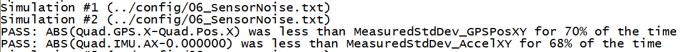
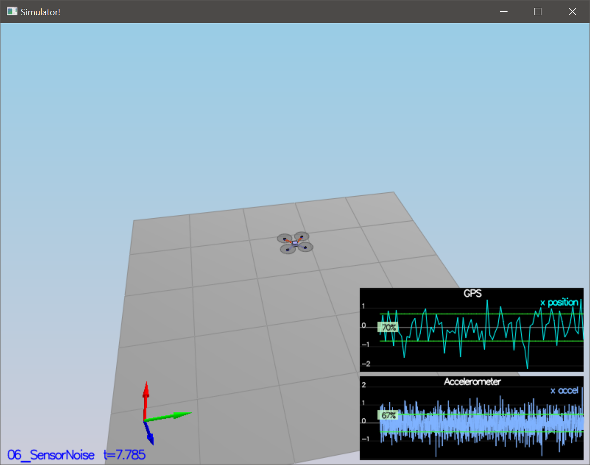

## Step 2: Attitude Estimation
Next step is to improve a complementary filter-type attitude filter which takes current attitude estimate (rollEst, pitchEst and ekfState(6)) into account to integrate the body rates into new Euler angles. There are several ways to go about this, including:
- create a rotation matrix based on your current Euler angles, integrate that, convert back to Euler angles
- use the Quaternion<float> class, which has a handy FromEuler123_RPY function for creating a quaternion from Euler Roll/PitchYaw
- Normalize result

```
  Quaternion<float> rotM = Quaternion<float>::FromEuler123_RPY(rollEst, pitchEst, ekfState(6));
  rotM.IntegrateBodyRate(gyro, dtIMU);

  float predictedPitch = rotM.Pitch();
  float predictedRoll = rotM.Roll();
  
  ekfState(6) = rotM.Yaw();
  
  // normalize yaw to -pi .. pi
  if (ekfState(6) > F_PI) ekfState(6) -= 2.f*F_PI;
  if (ekfState(6) < -F_PI) ekfState(6) += 2.f*F_PI;
```
### Results
Following the results of scenario `07_AttitudeEstimation` are shown. Estimated error is within the defined limits and actual vs estimate is very close together.

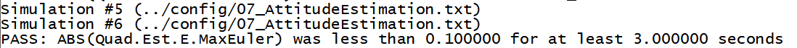
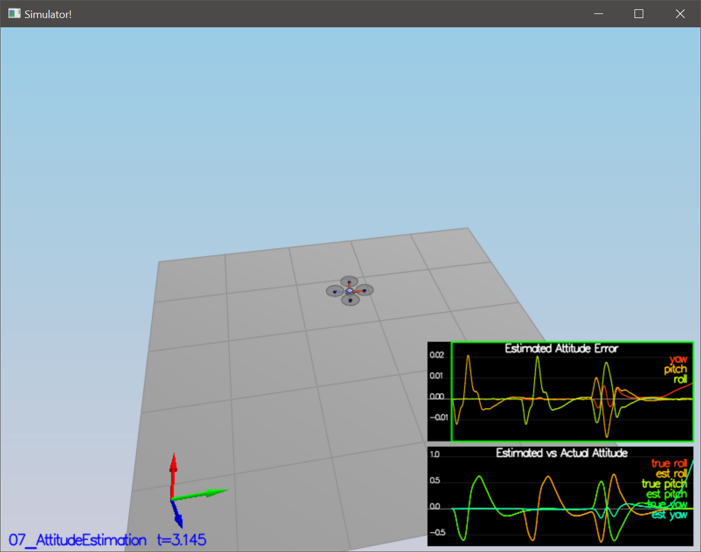

## Step 3: Prediction Step
### State Prediction
Next the prediction function is implemented. At first we need to convert from body to inertial frame.

```
  //   curState: starting state
  //   dt: time step to predict forward by [s]
  //   accel: acceleration of the vehicle, in body frame, *not including gravity* [m/s2]
  //   gyro: body rates of the vehicle, in body frame [rad/s]
  // - dt is the time duration for which you should predict. 
  // - we've created an Attitude Quaternion for you from the current state. Use 
  //   attitude.Rotate_BtoI(<V3F>) to rotate a vector from body frame to inertial frame
  
  //Convert from body frame to the inertial frame
  V3F acc_inertial = attitude.Rotate_BtoI(accel);

  // predict accelartion - correct z with g 
  predictedState(3) = curState(3) + acc_inertial.x * dt;
  predictedState(4) = curState(4) + acc_inertial.y * dt;
  predictedState(5) = curState(5) + acc_inertial.z * dt - CONST_GRAVITY * dt;

  // predict state
  predictedState(0) = curState(0) + curState(3) * dt; 
  predictedState(1) = curState(1) + curState(4) * dt; 
  predictedState(2) = curState(2) + curState(5) * dt; 
```
The following picture shows the result of scenario `08_PredictState`. The quadrotor is smothly following its course and that predicted and true values are again tightly correlated.

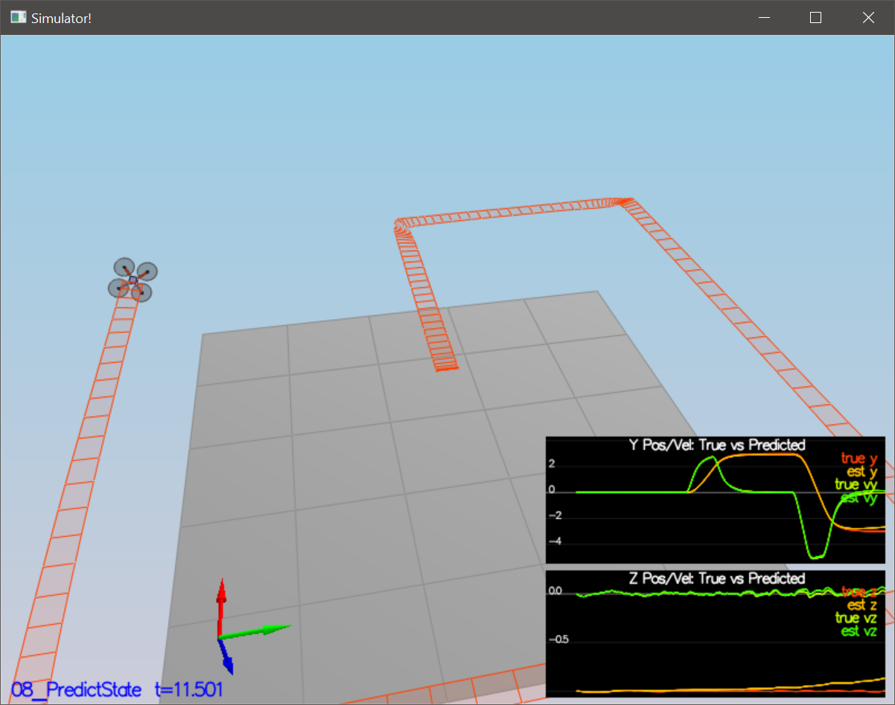

### Covariance Prediction
In addition to the previouse state prediction scenario, scenario `09_PredictCovariance` introduces a realistic noisy IMU. In QuadEstimatorEKF.cpp, a partial derivative of the body-to-global rotation matrix in the function GetRbgPrime() is calculated. After that the predict function can be finalized. The necessary code is shown below:

```
  // See "Estimation for Quadrotors" paper - Transition Model (52)
  // theta = pitch;
  // phi = roll;
  // psi = yaw;
  RbgPrime << -cos(pitch) * sin(yaw), 
  -sin(roll) * sin(pitch) * sin(yaw) - cos(pitch) * cos(yaw), 
  -cos(roll) * sin(pitch) * sin(yaw) + sin(roll) * cos(yaw), 
  cos(pitch) * cos(yaw), 
  sin(roll) * sin(pitch) * cos(yaw) - cos(roll) * sin(yaw), 
  cos(roll) * sin(pitch) * cos(yaw) + sin(roll) * sin(yaw), 
  0, 0, 0;
    
 // See "Estimation for Quadrotors" paper - Transition Model (51)
  gPrime(0, 3) = dt;
  gPrime(1, 4) = dt;
  gPrime(2, 5) = dt;
  gPrime(3, 6) = (RbgPrime(0) * accel).sum() * dt;
  gPrime(4, 6) = (RbgPrime(1) * accel).sum() * dt;
  gPrime(5, 6) = (RbgPrime(2) * accel).sum() * dt;

  // See "Estimation for Quadrotors" paper - EKF - Algorithm Predict
  // transposeInPlace() throws an error
  ekfCov = gPrime * ekfCov * gPrime.transpose() + Q;
```
The result looks like this. The Overall parameters are provided at the end of this `README`.

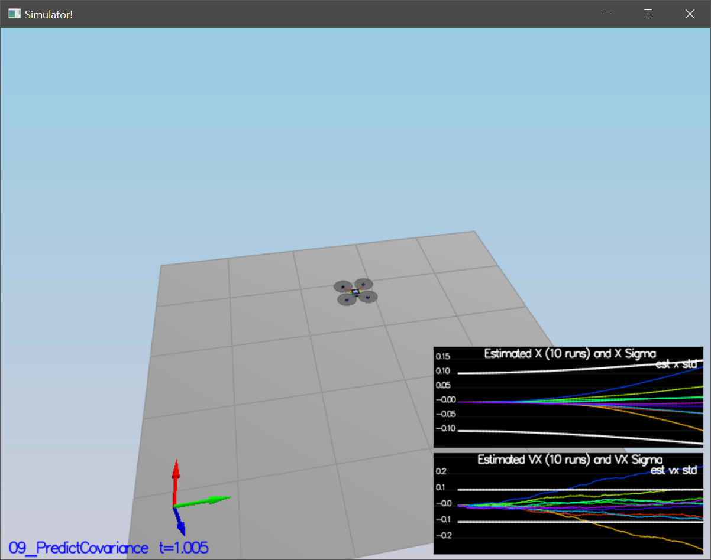

## Step 4: Magnetometer Update
Up until now only the accelerometer and gyro were used for state estimation. In this step, the information from the magnetometer will be added  to improve the filter's performance in estimating the vehicle's heading.
To take the Magentometer into account, only a small adaption is necessary:
```
  hPrime(0, 6) = 1; 

  zFromX(0) = ekfState(6);

  float diff = magYaw - zFromX(0);

  //normalize
  if (diff > F_PI) zFromX(0) += 2.f*F_PI;
  if (diff < -F_PI) zFromX(0) -= 2.f*F_PI;
```

### Results
The Magnetometer update is evaluated in scenario `10_MagUpdate`. The tuned parameter is provided the Parameter Set section. 

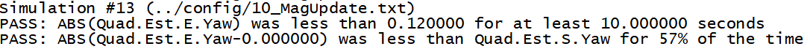
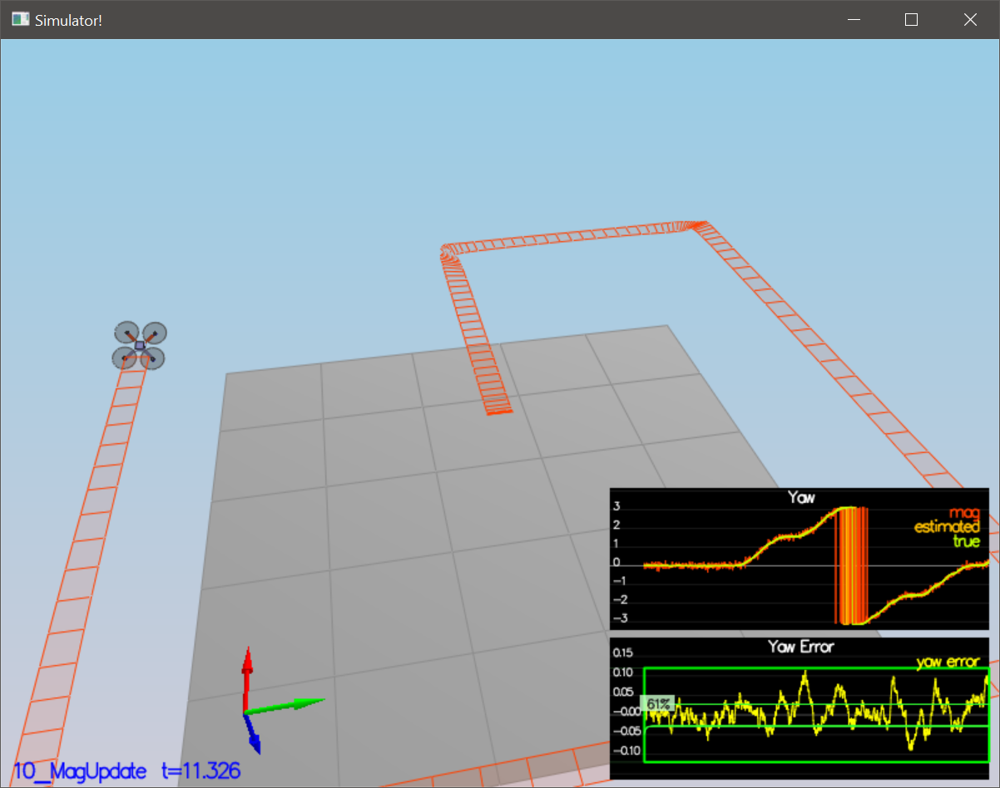

## Step 5: Closed Loop + GPS Update
In the last estimator update GPS is added. To do so, the estimator model needs to be tuned and the `UpdateFromGPS`. For the latter the Equations 53, 54 und 55 from 'Estimation for Quadrotors' from Andy Brown et al. have to be implemented.

```
  zFromX = hPrime * ekfState;

  // See "Estimation for Quadrotors" paper ( Eq. 55 )
  for (int i = 0; i < QUAD_EKF_NUM_STATES - 1; i++) {
	  hPrime(i, i) = 1;
  }

  // See "Estimation for Quadrotors" - GPS (  Eq. 53 & Eq. 54  )
  zFromX(0) = ekfState(0);
  zFromX(1) = ekfState(1);
  zFromX(2) = ekfState(2);
  zFromX(3) = ekfState(3);
  zFromX(4) = ekfState(4);
  zFromX(5) = ekfState(5);
```  
  
### Results
Scenario `11_GpsUpdate` proves, that the additions work as expected.

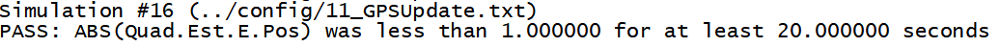
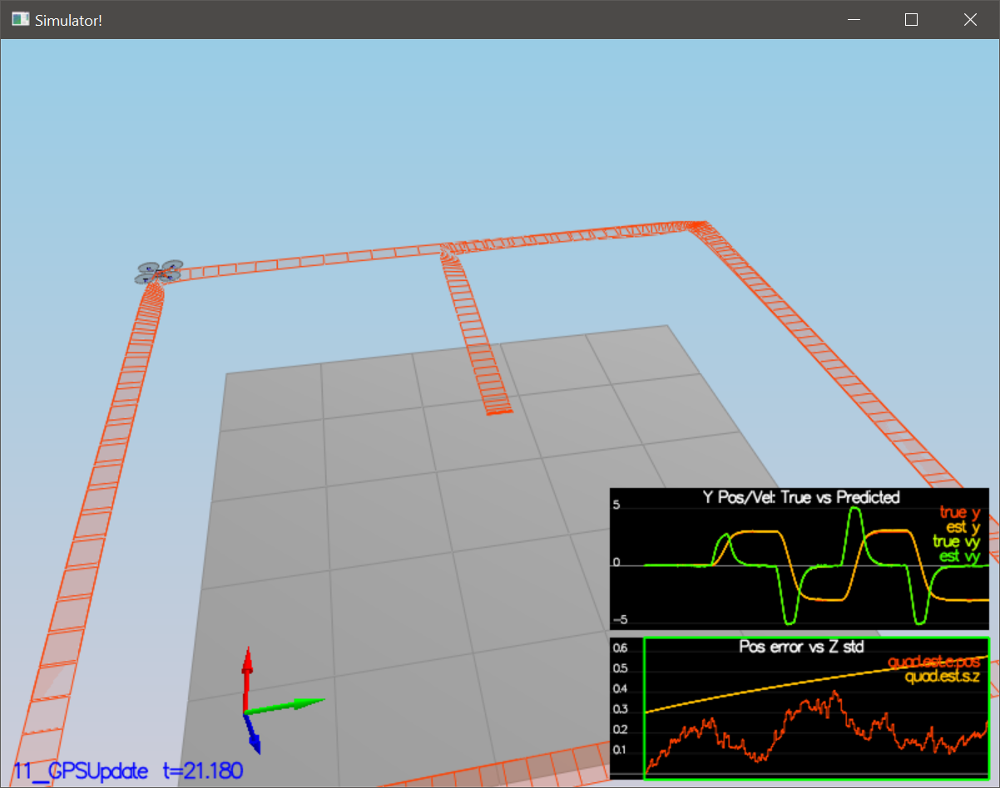

## Step 6: Adding Your Controller
### Results
Finally, after the estimator has been completed, the result is tested against or with controller from the previous project. Gladly this also turned out to be satisfactory withour any further tuning. See the results here.

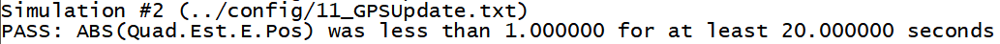


## Parameter Set
Following parameters (defined in `QuadEstimatorEKF.txt`) are used to tune the Estimator model:
```
[QuadEstimatorEKF]
InitState = 0, 0, -1, 0, 0, 0, 0
InitStdDevs = .1, .1, .3, .1, .1, .3, .05

# Process noise model
note that the process covariance matrix is diag(pow(QStd,2))*dtIMU
QPosXYStd = .035
QPosZStd = .05
QVelXYStd = .02
QVelZStd = .1
QYawStd = .08  

# GPS measurement std deviations
GPSPosXYStd = 1
GPSPosZStd = 100 #3
GPSVelXYStd = .1
GPSVelZStd = .3

# Magnetometer
MagYawStd = .1

dtIMU = 0.002
attitudeTau = 100
```
